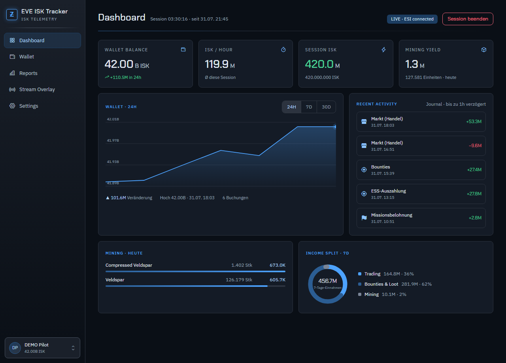
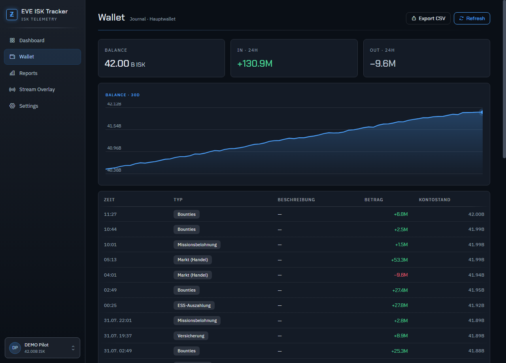
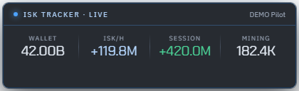
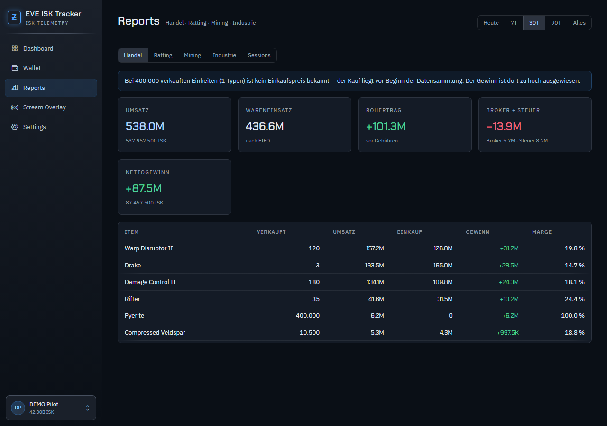
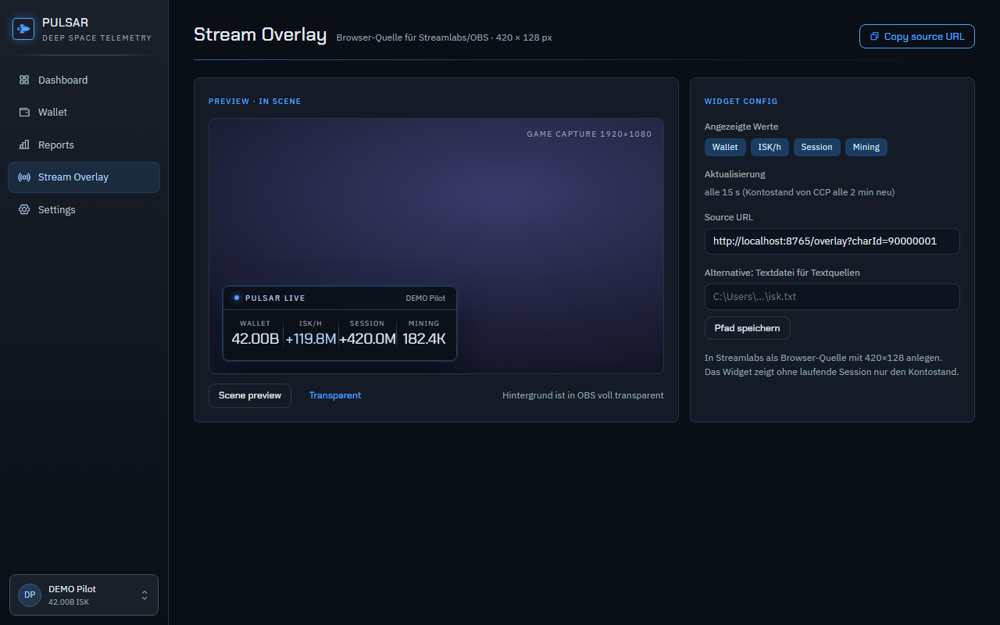

# EVE ISK Tracker

Windows-Desktop-App, die dein EVE-Online-Wallet über CCPs offizielle ESI-API ausliest, alle
Daten **dauerhaft lokal** sammelt und daraus Auswertungen rechnet — mit Live-Widget für
OBS/Streamlabs. Eine EXE, keine Installation, keine Cloud, kein fremder Server.



## Warum?

CCP liefert über die API nur ein rollierendes Fenster (Wallet-Journal und Transaktionen
reichen ca. 30 Tage zurück). Der EVE ISK Tracker ruft die Daten regelmäßig ab und behält sie in einer
lokalen SQLite-Datenbank — je länger die App mitläuft, desto weiter reicht die eigene
Historie zurück, auch über das hinaus, was das Spiel selbst noch anzeigt.

## Features

- **Dashboard** — Kontostand, ISK/h, Session-ISK, Mining-Ertrag; Wallet-Verlaufskurve
  (24h/7d/30d), letzte Buchungen, Einnahmen-Donut der letzten 7 Tage
- **Wallet** — Journal mit deutscher Kategorisierung, 30-Tage-Kurve, In/Out der letzten 24h,
  CSV-Export
- **Reports** — Handel mit **echter FIFO-Gewinnrechnung** (Einstandspreis statt bloßer
  Umsatzsumme, Broker-Gebühr und Verkaufssteuer separat), Ratting/Missionen, Mining,
  Industrie, **Kills & Verluste mit zKillboard-Werten und -Links**, Session-Historie
- **Sessions** — Start/Stopp per Klick, ISK-Differenz und ISK/h live, Zuordnung von
  Mining-Erträgen zum Session-Zeitfenster
- **Stream-Widget** — 420 × 240 px Browser-Quelle („ISK TRACKER · LIVE") im Stil klassischer
  Session-HUDs: Timer · Session-ISK · ISK/h · Bounties · Missionen · Mining · Wallet, jede
  Kachel per Klick an-/abwählbar (bis zu zwei Reihen), transparenter Hintergrund, Vorschau
  in der App; Update-Countdown im Dashboard zeigt, von wann der Stand ist

| Wallet | Stream-Widget |
|---|---|
|  |  |




## Sicherheit & Datenschutz

- Login über **EVE SSO (OAuth 2 mit PKCE)** — das Passwort wird nur auf CCPs eigener
  Login-Seite eingegeben, die App sieht es nie
- Kein Client-Secret in der App (bei einer verteilten EXE wäre es ohnehin nicht geheim)
- Das Refresh-Token liegt **DPAPI-verschlüsselt** lokal — nur das eigene Windows-Konto
  kann es lesen
- Die App spricht mit `esi.evetech.net`, `login.eveonline.com` und — nur für
  Kill-Bewertungen — `zkillboard.com`; Schriften/Icons kommen von Google Fonts bzw. unpkg (CDN)
- Alle Daten liegen in `%LOCALAPPDATA%\EveIskTracker\eveisk.db` (SQLite)

## Loslegen

1. `EveIskTracker.exe` starten (selbst bauen, siehe unten — oder aus einem GitHub-Release,
   falls vorhanden)
2. Auf [developers.eveonline.com](https://developers.eveonline.com/applications) eine
   eigene Anwendung anlegen (kostenlos): Connection Type **Authentication & API Access**,
   Callback URL exakt `http://localhost:8765/callback`, dazu diese Scopes:
   `esi-wallet.read_character_wallet.v1`, `esi-markets.read_character_orders.v1`,
   `esi-industry.read_character_mining.v1`, `esi-industry.read_character_jobs.v1`,
   `esi-assets.read_assets.v1`, `esi-killmails.read_killmails.v1`
3. Client ID in der App unter **Settings** eintragen → Speichern → **Charakter anmelden**

Die Callback-URL muss **nicht** aus dem Internet erreichbar sein — CCP leitet nur den
eigenen Browser auf `localhost` zurück. Ausführliche Schritte: [ANLEITUNG.md](ANLEITUNG.md)

### Widget in OBS/Streamlabs

**Stream Overlay** → **Copy source URL** → in OBS als Browser-Quelle mit **420 × 240**
anlegen. Ohne laufende Session zeigt das Widget nur den Kontostand. Die App muss dabei
laufen (Fenster darf zu sein — sie lebt dann im Tray weiter).

## Selbst bauen

Voraussetzung: [.NET 6 SDK](https://dotnet.microsoft.com/download/dotnet/6.0) und die
WebView2-Runtime (auf Windows 11 vorhanden).

```bash
dotnet publish EveIskTracker.Desktop -c Release -r win-x64 --self-contained true -p:PublishSingleFile=true -p:IncludeNativeLibrariesForSelfExtract=true -p:EnableCompressionInSingleFile=true -o release
```

Tests (45 Rechenprüfungen, u.a. FIFO-Randfälle):

```bash
dotnet run --project EveIskTracker.Tests
```

Demo-Daten zum Ausprobieren ohne EVE-Login (`unseed` entfernt sie wieder):

```bash
dotnet run --project EveIskTracker.Tests -- seed
```

## Architektur

```
EveIskTracker.Desktop/   WinForms-Fenster (WebView2) + interner Kestrel-Server (Port 8765)
  Program.cs             Einstieg, Einzelinstanz-Schutz, --tray für Autostart
  MainForm.cs            Fenster, Tray-Icon, dunkle Titelleiste
  WebHost.cs             HTTP-Endpunkte: Oberfläche, API, Widget, OAuth-Callback
  Db.cs                  SQLite-Schema (dauerhafte Datensammlung)
  EsiClient.cs           ESI-HTTP mit ETag-Cache und Fehlerlimit-Beachtung
  Sso.cs                 EVE SSO v2 mit PKCE
  SyncService.cs         Abgleich im Takt der ESI-Cache-Zeiten
  Analytics.cs           FIFO-Engine, Ratting/Mining/Industrie-Auswertung
  Sessions.cs            Session-Verfolgung
  wwwroot/               Oberfläche (in die EXE eingebettet)
EveIskTracker.Tests/     Rechentests + Demo-Daten-Seeder
```

Der interne Webserver ist kein Beiwerk: OBS holt sich das Widget per HTTP, und CCPs
OAuth-Login braucht den `localhost`-Callback.

## Grenzen (ehrlich gesagt)

- **ESI-Cache-Zeiten** bestimmen die Aktualität: Kontostand alle 2 min, Journal stündlich.
  Schnelleres Polling brächte nichts, CCP liefert bis dahin dieselbe Antwort.
- **FIFO braucht Historie**: Verkäufe von Items, die vor der ersten Datensammlung gekauft
  wurden, haben keinen Einstandspreis — die App weist das offen aus.
- **Industrie ohne Materialkosten**: ESI liefert zu Jobs nur Installationskosten; der
  Saldo ist entsprechend optimistisch.
- **Kill-Werte von zKillboard** — ESI liefert Killmails ohne ISK-Wert; die Bewertung kommt
  von zkillboard.com (eine Anfrage je neuem Kill). Ist zKillboard nicht erreichbar, wird der
  Kill trotzdem gelistet, nur ohne Wert.

## Danksagung

- [EVE Online / CCP Games](https://www.eveonline.com/) — ESI-API und SSO.
  EVE Online und alle zugehörigen Marken sind Eigentum von CCP hf.
- Design: „PULSAR" auf Basis des Nocturne-Design-Systems
- [Phosphor Icons](https://phosphoricons.com/), Schriften: Chakra Petch & IBM Plex Sans
