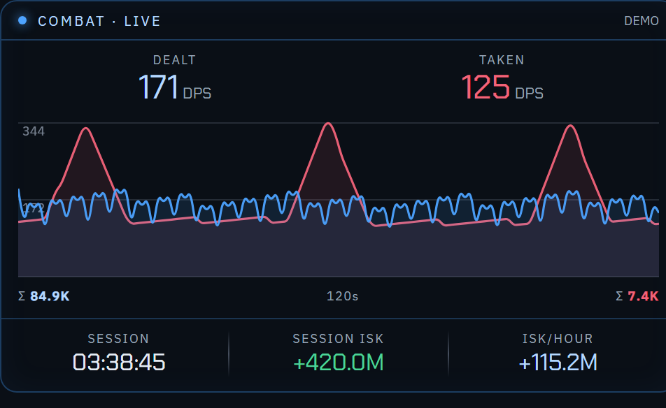
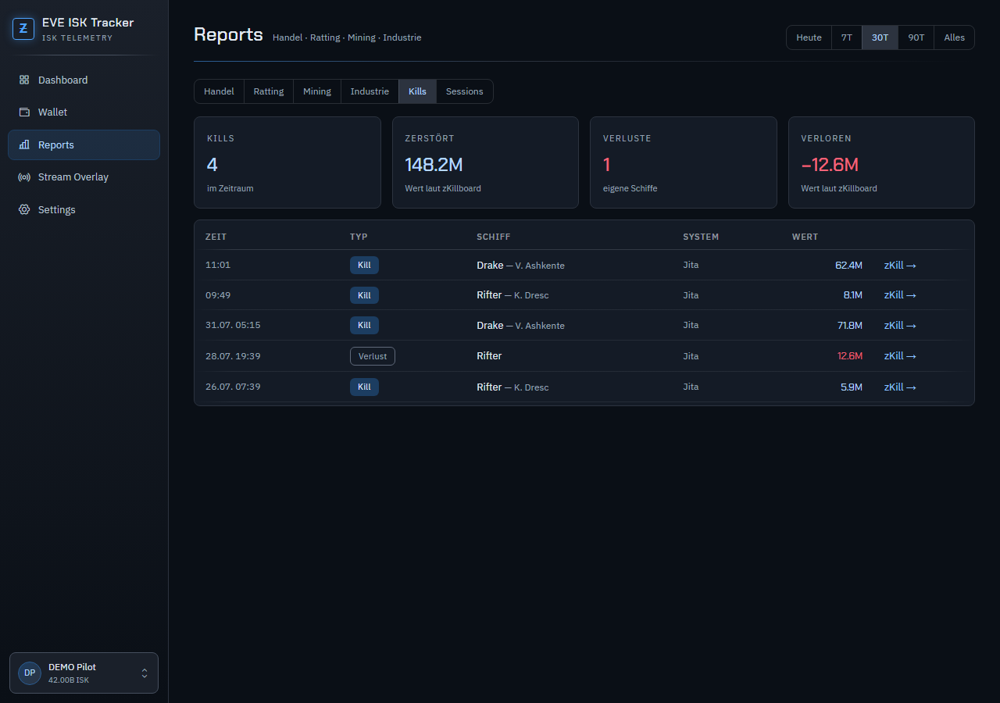
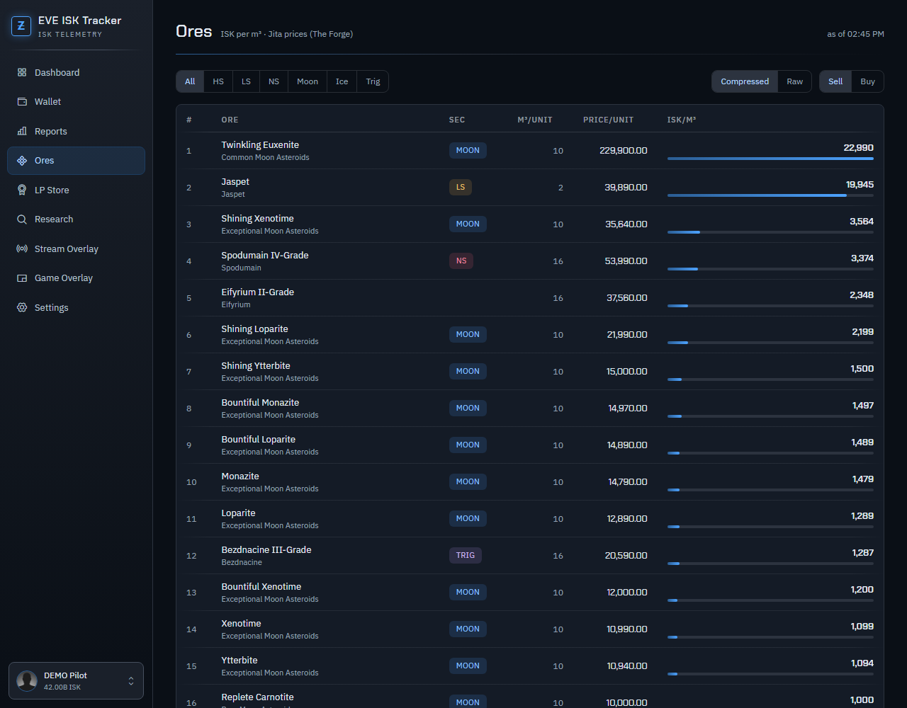
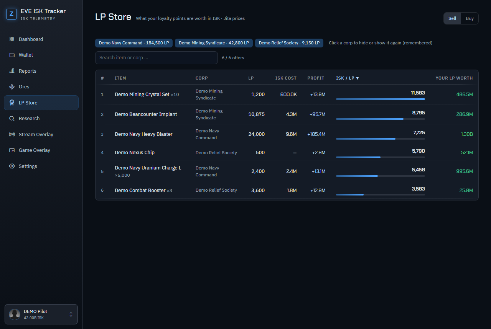
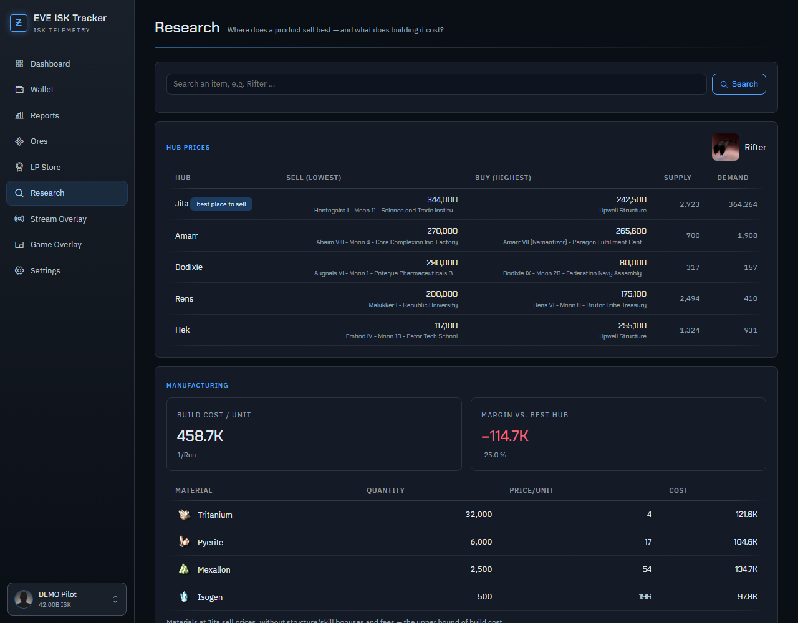
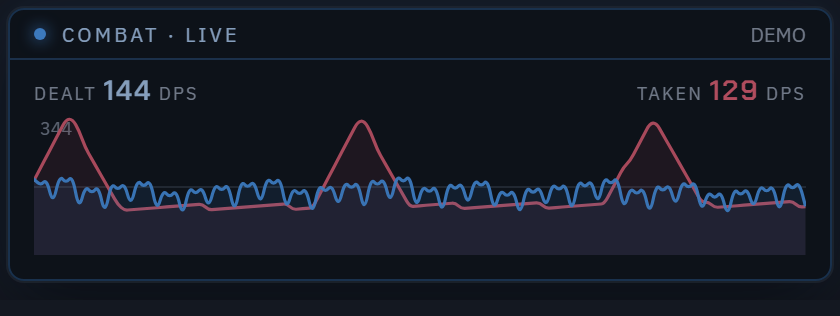

# EVE ISK Tracker

A Windows desktop app that reads your EVE Online wallet through CCP's official ESI API,
keeps **all data permanently on your machine**, and turns it into useful analytics — with a
live session HUD widget for OBS/Streamlabs. One EXE, no installation, no cloud, no
third-party server.

**UI available in English and German** (switchable in Settings).


## Why?

CCP's API only serves a rolling window (wallet journal and transactions go back ~30 days).
EVE ISK Tracker polls the data regularly and keeps it in a local SQLite database — the
longer the app runs, the further back your own history reaches, beyond what the game
itself still shows you.

## Features

- **Dashboard** — wallet balance, ISK/h, session ISK, mining yield; wallet history chart
  (24h/7d/30d), recent activity, 7-day income split donut
- **Wallet** — journal with categorized entries, 30-day balance chart, in/out last 24h,
  CSV export
- **Reports** — trading with **real FIFO profit calculation** (actual cost basis instead of
  raw revenue, broker fees and sales tax separated), ratting/missions, mining, industry,
  **kills & losses with zKillboard values and links**, session history
- **Sessions** — start/stop with one click, live ISK delta and ISK/h, mining attribution
  to the session window
- **Ore chart** — every mineable ore (belt, moon, ice, Triglavian, incl. all variants and
  compressed forms, pulled dynamically from ESI) ranked by **ISK per m³** with live Jita
  buy/sell prices, filterable by security band — inspired by ore.cerlestes.de
- **Stream widget** — browser source styled like classic session HUDs: timer · session
  ISK · ISK/h · bounties · missions · kills · destroyed · mining · wallet · **live DPS
  graph**, each tile toggleable, optional character portrait & name in the header, fully
  transparent background, live preview inside the app that shows the recommended source
  size for your tile selection
- **Standalone DPS source** — the combat graph as its own 420 × 150 browser source,
  placeable anywhere in your scene
- **LP store comparison** — see what your loyalty points are worth: all offers from the
  corps you hold LP with, valued at Jita prices (including required items), ranked by
  **ISK per LP** — plus what your current LP balance would pay out at each offer. Hide
  corps you never actually trade with (remembered, and skipped when refreshing), search
  by item or corp, and sort by any column
- **Product research** — search any item and compare best sell/buy prices across the five
  major trade hubs, plus its manufacturing bill of materials with Jita-priced build cost
  and margin vs. the best hub (blueprint data from EVE Ref)
- **Game overlay** — Discord-style in-game HUD: an always-on-top, click-through window
  over the EVE client with a **live DPS graph** (damage dealt vs. taken, parsed from
  EVE's local game logs) and session stats; toggle any time with **Ctrl+Shift+O**
- **Update countdown** — the dashboard shows exactly how old the current numbers are and
  when the next refresh arrives

| Wallet | Stream widget |
|---|---|
|  |  |

The in-game overlay (DPS graph + session stats), floating over the EVE client:










## Getting started

1. Download `EveIskTracker.exe` from [Releases](../../releases) and run it
   (Windows 10/11 with the WebView2 runtime, which ships with Windows 11).
2. Go to **Settings → Sign in character** and log in on CCP's official SSO page.
3. Done. The first sync starts automatically.

Official release builds ship with a built-in ESI application registration, so there is
nothing to configure. If you prefer to use **your own CCP application** (or you build from
source, where no default is embedded), see [SETUP.md](SETUP.md).

> Windows SmartScreen warns about unsigned downloads — "More info" → "Run anyway".

### Game overlay (in-game HUD)

**Game Overlay → Show overlay** (or **Ctrl+Shift+O** anywhere). The HUD floats above the
EVE client — always on top, click-through, never steals focus. The DPS graph tails EVE's
game logs in `Documents\EVE\logs\Gamelogs` (read-only, no game modification, works in any
client language) and follows the character you pick in the app. Use *Adjust position*
to drag it where you want; pick the view (**detailed** with graph and totals, or a **compact** number strip), modules (DPS
graph, session stats) and opacity (10–100 % slider) in the app. EVE must run in
**windowed** or **borderless fullscreen** mode — nothing can draw over exclusive
fullscreen.

### Widget in OBS/Streamlabs

**Stream Overlay** → **Copy source URL** → add it as a browser source in OBS/Streamlabs
at the size the app recommends (it is shown next to the URL and follows your tile
selection). Pick which tiles to show — including the **live DPS graph** — and whether to
show your character portrait and name; changes apply to the running widget within seconds.
The combat graph is also available as its own source (**DPS graph as separate source**,
420 × 150) if you would rather place it elsewhere in your scene:



All browser sources follow the character you select at the bottom left of the app, so
switching characters mid-stream needs no changes in OBS. Append `&pin=1` to a URL to lock
that source to one specific character instead. Without an active session the widget shows
the wallet balance. The app must be running — the window may be closed, it keeps living in
the tray.

## Security & privacy

- Sign-in via **EVE SSO (OAuth 2 with PKCE)** — your password is only ever entered on
  CCP's own page; the app never sees it
- No client secret anywhere (a distributed EXE could not keep one secret anyway; PKCE is
  designed for exactly this)
- The refresh token is stored **DPAPI-encrypted** — only your Windows account can read it
- The app talks to `esi.evetech.net`, `login.eveonline.com`, `images.evetech.net`
  (character portraits and item icons), `zkillboard.com` (kill valuations) and
  `ref-data.everef.net` (blueprint data for the build-cost breakdown);
  fonts/icons come from Google Fonts / unpkg (CDN)
- The DPS graph reads the EVE client's own combat logs in `Documents\EVE\logs\Gamelogs`
  **read-only** — nothing is written to the game, and no log content ever leaves your
  machine
- All data lives in `%LOCALAPPDATA%\EveIskTracker\eveisk.db` (SQLite), with an automatic
  daily snapshot backup next to it

## Building from source

Requires the [.NET 6 SDK](https://dotnet.microsoft.com/download/dotnet/6.0) and the
WebView2 runtime.

```bash
dotnet publish EveIskTracker.Desktop -c Release -r win-x64 --self-contained true -p:PublishSingleFile=true -p:IncludeNativeLibrariesForSelfExtract=true -p:EnableCompressionInSingleFile=true -o release
```

Source builds contain **no default client ID** — either enter your own CCP application's
client ID in Settings (see [SETUP.md](SETUP.md)), or pass one at build time with
`-p:DefaultClientId=...`.

Tests (72 checks: FIFO edge cases, combat-log parsing, DPS buckets, LP valuation):

```bash
dotnet run --project EveIskTracker.Tests
```

Demo data to explore the UI without an EVE login (`unseed` removes it again):

```bash
dotnet run --project EveIskTracker.Tests -- seed
```

## Architecture

```
EveIskTracker.Desktop/   WinForms window (WebView2) + internal Kestrel server (port 8765)
  Program.cs             entry point, single-instance guard, --tray for autostart
  MainForm.cs            window, tray icon, dark title bar
  WebHost.cs             HTTP endpoints: UI, API, widget, OAuth callback
  Db.cs                  SQLite schema (permanent data collection, WAL + daily backup)
  EsiClient.cs           ESI HTTP with ETag caching and error-limit awareness
  Sso.cs                 EVE SSO v2 with PKCE
  SyncService.cs         background sync paced by CCP's cache timers
  Analytics.cs           FIFO engine, ratting/mining/industry analytics
  Sessions.cs            session tracking
  CombatLog.cs           combat-log tailing, DPS buckets (in-game overlay + widgets)
  GameOverlayForm.cs     click-through in-game HUD window (GPU-free, isolated process)
  LpStore.cs             LP store offers + Jita valuation (ISK per LP)
  Research.cs            hub price comparison and build-cost breakdown
  wwwroot/               UI (embedded into the EXE), i18n en/de
EveIskTracker.Tests/     calculation tests + demo data seeder
```

The internal web server is not incidental: OBS fetches the widget over HTTP, and CCP's
OAuth sign-in needs the `localhost` callback.

## Honest limitations

- **ESI cache timers** dictate freshness: wallet balance every 2 min, journal hourly.
  Polling faster returns identical data — no tool can go below this.
- **FIFO needs history**: sales of items bought before data collection started have no
  cost basis — the app flags this openly instead of hiding it.
- **Industry without material costs**: ESI only provides job installation costs; the
  balance shown is accordingly optimistic.
- **Kill values come from zKillboard** (one request per new kill). If zKillboard is
  unreachable, the kill is still listed, just without a value.

## Useful links

The Settings screen also links these community resources:
[zKillboard](https://zkillboard.com/) ·
[Cerlestes Ore Table](https://ore.cerlestes.de/ore) ·
[EVE Ref](https://everef.net/) ·
[DOTLAN EveMaps](https://evemaps.dotlan.net/) ·
[Fuzzwork](https://www.fuzzwork.co.uk/) ·
[EVE Tycoon](https://evetycoon.com/) ·
[EVE University Wiki](https://wiki.eveuniversity.org/) ·
[pyfa](https://github.com/pyfa-org/Pyfa)

## Acknowledgements

- [EVE Online / CCP Games](https://www.eveonline.com/) — ESI API, SSO and image server.
  EVE Online and all related trademarks are the property of CCP hf.
- [zKillboard](https://zkillboard.com/) — kill valuations
- [EVE Ref](https://everef.net/) — blueprint reference data for the build-cost breakdown
- Design: "PULSAR" theme based on the Nocturne design system
- [Phosphor Icons](https://phosphoricons.com/), fonts: Chakra Petch & IBM Plex Sans
